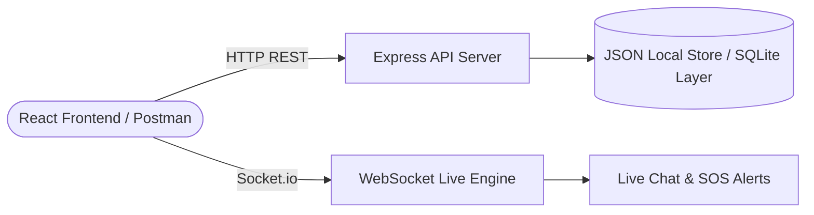

# 📘 ICBT UniRide — Backend REST & WebSocket API Documentation

> **Base URL:** `http://localhost:5000`  
> **Protocol:** HTTP/1.1 REST + WebSocket (Socket.io v4)  
> **Auth Scheme:** JWT Bearer Token (`Authorization: Bearer <token>`)

---

## 📑 Table of Contents
1. [System Architecture & Roles](#1-system-architecture--roles)
2. [Default Credentials](#2-default-credentials)
3. [Authentication Endpoints](#3-authentication-endpoints)
4. [Driver Verification Workflow](#4-driver-verification-workflow)
5. [Carpool Rides Endpoints](#5-carpool-rides-endpoints)
6. [Seat Bookings & Boarding Pass](#6-seat-bookings--boarding-pass)
7. [Ratings & Reviews](#7-ratings--reviews)
8. [Real-time Chat & In-App Messaging](#8-real-time-chat--in-app-messaging)
9. [Emergency SOS Safety Network](#9-emergency-sos-safety-network)
10. [Admin & Security Control Panel](#10-admin--security-control-panel)
11. [WebSocket Events Specification](#11-websocket-events-specification)
12. [Postman & OpenAPI Specifications](#12-postman--openapi-specifications)

---

## 1. System Architecture & Roles



### User Roles:
- **`student` / `staff` (Passenger)**: Can search carpool rides, filter by pickup / destination, book seats, rate drivers, chat, and trigger emergency SOS.
- **`driver` (Verified Driver)**: Can publish campus carpool routes with waypoints, manage passenger seat reservations, view quota tags, and chat.
- **`admin` (Campus Security Officer)**: Full access to verify/reject driver applications, inspect submitted licenses, view real-time SOS broadcast alerts, and audit user directory.

---

## 2. Default Credentials

| Role | Email | Password | Pre-configured Status |
| :--- | :--- | :--- | :--- |
| **Admin Officer** | `admin@icbt.edu.lk` | `admin123` | Administrator role (`system_role: "admin"`) |
| **Verified Driver** | `kamal.driver@icbt.edu.lk` | `driver123` | Approved driver (`odd_even_type: "ODD"`, Toyota Aqua) |
| **Passenger** | `nimal.student@icbt.edu.lk` | `student123` | Student commuter |
| **Pending Driver** | `dilani.pending@icbt.edu.lk` | `pending123` | Awaiting admin review |
| **Unverified User** | `sanduni.user@icbt.edu.lk` | `user123` | Fresh account |

---

## 3. Authentication Endpoints

### 3.1 Register User
- **Endpoint:** `POST /api/auth/register`
- **Request Body:**
```json
{
  "name": "Kasun Bandara",
  "email": "kasun@icbt.edu.lk",
  "password": "password123",
  "role": "student",
  "student_staff_id": "ICBT-ST-2024-99",
  "phone": "+94 77 123 4567"
}
```
- **Response `201 Created`:**
```json
{
  "message": "Account created successfully",
  "token": "eyJhbGciOiJIUzI1NiIsInR5cCI6IkpXVCJ9...",
  "user": {
    "id": 6,
    "name": "Kasun Bandara",
    "email": "kasun@icbt.edu.lk",
    "role": "student",
    "system_role": "user"
  }
}
```

### 3.2 Login
- **Endpoint:** `POST /api/auth/login`
- **Request Body:**
```json
{
  "email": "nimal.student@icbt.edu.lk",
  "password": "student123"
}
```
- **Response `200 OK`:** Returns JWT Bearer token and user profile.

### 3.3 Get Current Profile
- **Endpoint:** `GET /api/auth/me`
- **Headers:** `Authorization: Bearer <token>`

### 3.4 Update Profile & Change Password
- **Endpoint:** `PUT /api/auth/profile`
- **Headers:** `Authorization: Bearer <token>`
- **Request Body:**
```json
{
  "name": "Nimal Silva",
  "phone": "+94 76 998 1122",
  "student_staff_id": "ICBT-ST-2024-42",
  "current_password": "student123",
  "new_password": "newpassword123"
}
```

---

## 4. Driver Verification Workflow

### 4.1 Submit Driver Documents
- **Endpoint:** `POST /api/verification/driver`
- **Headers:** `Authorization: Bearer <token>`
- **Request Body:**
```json
{
  "license_number": "B-9876543-LK",
  "vehicle_model": "Toyota Aqua (Hybrid)",
  "vehicle_plate": "WP-CBH-4521",
  "seats": 4,
  "fuel_type": "Hybrid",
  "license_doc_url": "https://...",
  "vehicle_photo_url": "https://..."
}
```

---

## 5. Carpool Rides Endpoints

### 5.1 Search Rides
- **Endpoint:** `GET /api/rides`
- **Query Parameters:**
  - `origin` *(string)*: Filter pickup area (e.g. `Gampaha`)
  - `destination` *(string)*: Filter arrival destination (e.g. `Campus`)
  - `date` *(YYYY-MM-DD)*: Filter departure date
  - `oddEven` *("ODD" | "EVEN")*: Filter plate quota rule
  - `maxPrice` *(number)*: Maximum fuel share fare

### 5.2 Publish Ride (Verified Drivers Only)
- **Endpoint:** `POST /api/rides`
- **Headers:** `Authorization: Bearer <token>`
- **Request Body:**
```json
{
  "origin": "Gampaha Town",
  "destination": "ICBT Colombo Campus",
  "route_waypoints": ["Miriswatta", "Kiribathgoda", "Kelaniya"],
  "departure_date": "2026-08-18",
  "departure_time": "07:30",
  "total_seats": 4,
  "price_per_seat": 350,
  "notes": "Daily campus commute along Kandy Road."
}
```

---

## 6. Seat Bookings & Boarding Pass

### 6.1 Reserve Carpool Seat
- **Endpoint:** `POST /api/bookings`
- **Headers:** `Authorization: Bearer <token>`
- **Request Body:**
```json
{
  "ride_id": 1,
  "seats_booked": 1,
  "pickup_location": "Kiribathgoda Junction"
}
```
- **Response `201 Created`:**
```json
{
  "message": "Seat booked successfully",
  "booking": {
    "id": 2,
    "ride_id": 1,
    "passenger_id": 3,
    "seats_booked": 1,
    "pickup_location": "Kiribathgoda Junction",
    "booking_code": "BK-492108",
    "status": "confirmed"
  }
}
```

### 6.2 Get My Bookings
- **Endpoint:** `GET /api/bookings/my-bookings`
- **Headers:** `Authorization: Bearer <token>`

---

## 7. Ratings & Reviews

### 7.1 Submit Driver Rating
- **Endpoint:** `POST /api/reviews`
- **Headers:** `Authorization: Bearer <token>`
- **Request Body:**
```json
{
  "ride_id": 1,
  "reviewee_id": 2,
  "rating": 5,
  "comment": "Punctual, safe, and pleasant drive to ICBT campus."
}
```

---

## 8. Real-time Chat & In-App Messaging

### 8.1 Fetch Chat History
- **Endpoint:** `GET /api/messages/{ride_id}`
- **Headers:** `Authorization: Bearer <token>`

### 8.2 Send Chat Message (REST Fallback)
- **Endpoint:** `POST /api/messages`
- **Headers:** `Authorization: Bearer <token>`
- **Request Body:**
```json
{
  "ride_id": 1,
  "text": "I am standing near the supermarket entrance."
}
```

---

## 9. Emergency SOS Safety Network

### 9.1 Trigger SOS Emergency Broadcast
- **Endpoint:** `POST /api/rides/{id}/sos`
- **Headers:** `Authorization: Bearer <token>`
- **Request Body:**
```json
{
  "location": "Kiribathgoda Junction",
  "message": "Flat tyre / vehicle issue, need support."
}
```
- **Action:** Broadcasts an instant high-priority `sos_alert` event across WebSocket to all connected passengers, drivers, and the Campus Security control panel.

---

## 10. Admin & Security Control Panel

All admin endpoints require `system_role: "admin"`.

### 10.1 Global KPI Statistics
- **Endpoint:** `GET /api/admin/stats`

### 10.2 Driver Verification Queue
- **Endpoint:** `GET /api/admin/verifications`

### 10.3 Approve or Reject Driver Application
- **Endpoint:** `POST /api/admin/verifications/driver/{id}/action`
- **Request Body:**
```json
{
  "action": "approved",
  "comment": "Verified with ICBT Student Registry and RMV record"
}
```

### 10.4 Commuter Registry & Fleet Management
- **Endpoint:** `GET /api/admin/users`
- **Endpoint:** `GET /api/admin/rides`
- **Endpoint:** `DELETE /api/admin/rides/{id}`

---

## 11. WebSocket Events Specification

Connect to `ws://localhost:5000` via Socket.io client.

| Event Name | Direction | Payload | Description |
| :--- | :--- | :--- | :--- |
| `join_ride_room` | Client $\rightarrow$ Server | `{ rideId, userId }` | Join room `ride-{rideId}` |
| `leave_ride_room` | Client $\rightarrow$ Server | `{ rideId }` | Leave room `ride-{rideId}` |
| `send_message` | Client $\rightarrow$ Server | `{ rideId, senderId, senderName, senderAvatar, text }` | Send live chat message |
| `new_message` | Server $\rightarrow$ Client | `{ id, ride_id, sender_id, sender_name, text, created_at }` | Real-time chat message delivery |
| `sos_alert` | Server $\rightarrow$ Client | `{ alertId, rideId, userName, userPhone, location, message, timestamp }` | Real-time emergency broadcast |

---

## 12. Postman & OpenAPI Specifications

- **OpenAPI 3.0.3 Specification:** [openapi.json](file:///C:/Users/USER/.gemini/antigravity/scratch/carpool-app/server/openapi.json)
- **Postman Collection v2.1.0:** [postman_collection.json](file:///C:/Users/USER/.gemini/antigravity/scratch/carpool-app/server/postman_collection.json)
