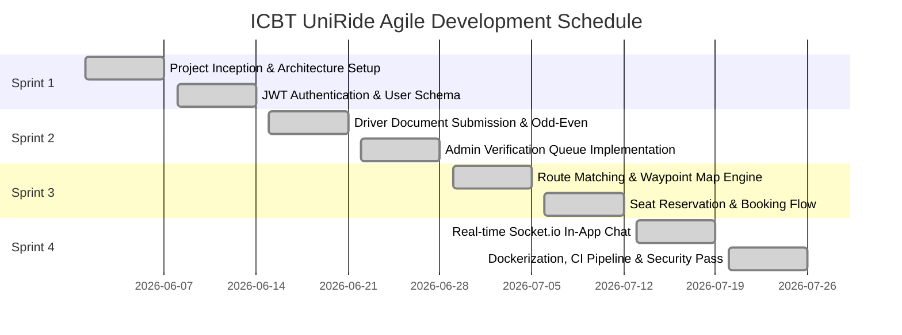
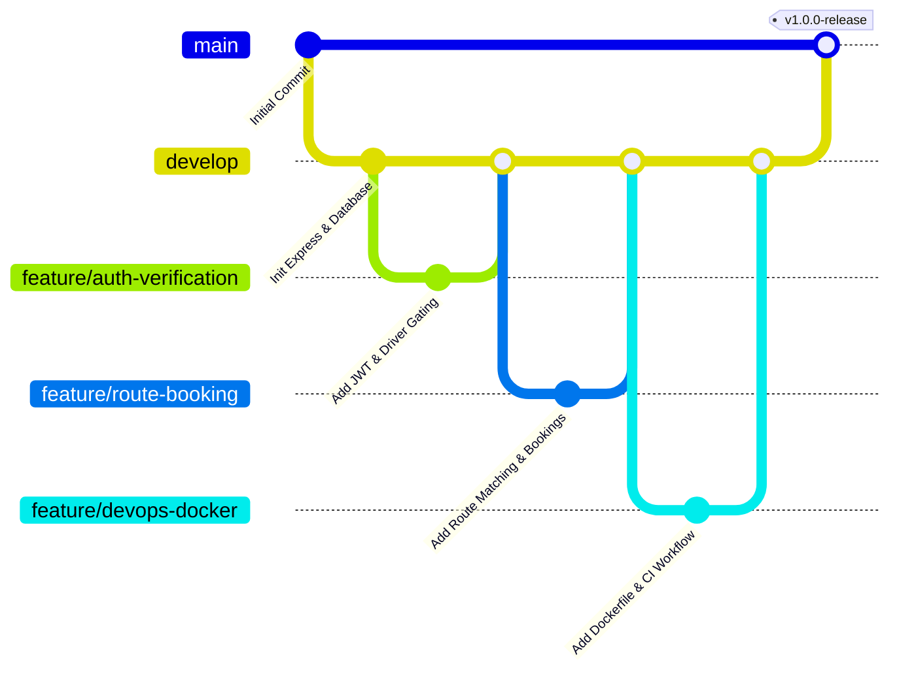

# CARDIFF SCHOOL OF TECHNOLOGIES / ICBT CAMPUS
## SEN5002: Agile Development and DevOps
### Assessment Portfolio Report: Developing a University Carpooling Application Using Agile and DevOps

---

## Executive Summary
During fuel supply disruptions and national quota-based restrictions (including odd-even number plate rationing) in Sri Lanka, university students and staff faced severe commuting challenges. The **ICBT UniRide** platform is a full-stack, client-server carpooling application designed to optimize fuel utilization, enforce strict campus verification policies, and provide real-time coordination between passengers and verified drivers.

This portfolio documents the end-to-end software engineering lifecycle across four distinct phases:
1. **Project Planning Phase (PPP)**: Agile product vision, measurable success metrics, work breakdown structure (WBS), and risk/contingency matrix.
2. **Requirements Engineering Phase (REP)**: User personas, real-world commute scenarios, MoSCoW-prioritized user stories with BDD/Gherkin acceptance criteria, and system flow architectures.
3. **Agile and DevOps Phase (ADOP)**: Four-sprint Scrum schedule, velocity tracking, sprint retrospectives with continuous process adaptation, Git branching strategy, multi-stage Docker containerization, and continuous integration pipeline.
4. **Testing, Software Security, and Deployment Phase (TSSDP)**: Test-Driven Development (TDD) automated unit and integration test suite, STRIDE security threat analysis, role-based verification gating, and production readiness.

---

# Phase 1: Project Planning Phase (10%)

## 1.1 Product Vision Statement
> *"To provide ICBT university students and faculty with a dependable, secure, and collaborative campus transit platform that optimizes personal vehicle usage during national fuel quota rationing, decreases individual commuting expenses by up to 65%, and guarantees campus safety through mandatory administrative driver and vehicle verification."*

### Measurable Success Criteria & Testable Outcomes
| Objective | Key Performance Indicator (KPI) | Measurement Method | Target Outcome |
| :--- | :--- | :--- | :--- |
| **Fuel Quota Optimization** | Average vehicle occupancy per campus commute trip | Real-time database booking analytics | Increase from 1.2 to **3.4 passengers/vehicle** |
| **Commute Reliability** | Matched ride completion rate | Booking status log audits | **> 92%** on-time arrival rate |
| **Campus Security** | Unverified driver ride publication rate | Backend permission gating automated tests | **0%** (100% blocked before admin review) |
| **Odd-Even Compliance** | Quota-day compatible vehicle scheduling | Algorithmic plate digit validation | **100%** alignment with daily national quotas |
| **DevOps Agility** | Automated test pass rate & CI build time | GitHub Actions pipeline duration | **< 3 minutes** build duration with 0 test failures |

## 1.2 Software Product Management & Work Breakdown Structure (WBS)
The project utilized an iterative Agile framework scheduled across four 2-week sprints:



## 1.3 Risk Assessment and Contingency Planning
| Risk ID | Identified Risk Description | Impact | Probability | Mitigation Strategy & Contingency Action |
| :--- | :--- | :--- | :--- | :--- |
| **R-01** | Unauthorized users offering rides without valid licenses | **Critical** | High | Implemented strict server-side middleware `requireApprovedDriver` blocking non-verified users from accessing ride creation APIs. |
| **R-02** | National fuel quota rule changes or odd-even date shifts | **Moderate** | Medium | Abstracted the quota engine into a dynamic module where rule parameters can be updated centrally. |
| **R-03** | Communication breakdowns for pickup points | **High** | Medium | Integrated bi-directional WebSocket (Socket.io) instant messaging and generated persistent 6-digit booking codes. |
| **R-04** | Container environment build drift | **Moderate** | Low | Multi-stage Docker builds pin Node.js version to 20-alpine with reproducible lockfiles (`package-lock.json`). |

---

# Phase 2: Requirements Engineering Phase (20%)

## 2.1 User Personas

### Persona 1: Student Commuter (Passenger)
- **Name**: Nimal Silva (Age 21, BSc Software Engineering Undergraduate)
- **Context**: Commutes daily from Kiribathgoda to Colombo 04 campus. Does not own a vehicle and suffers from overloaded public transport and irregular bus schedules due to fuel shortages.
- **Goals**: Find verified peers commuting on Kandy Road, reserve a seat affordably, and know the exact pickup location in real-time.
- **Pain Points**: Long bus wait times, surge pricing from commercial ride-hailing apps, safety concerns with unknown drivers.

### Persona 2: Faculty Member / Driver (Rider)
- **Name**: Kamal Perera (Age 29, Computing Lecturer & Car Owner)
- **Context**: Owns a hybrid car (Plate: WP-CBH-4521, Odd Quota Tag) driving from Gampaha to ICBT Colombo.
- **Goals**: Share travel fuel expenses with university peers, maximize his weekly fuel quota utility, and avoid empty seats.
- **Pain Points**: Rising petrol costs, difficulty finding reliable carpoolers without constant phone calls, need for campus verification.

### Persona 3: Campus Security Administrator
- **Name**: Officer Bandara (Campus Safety & Facilities Manager)
- **Context**: Responsible for student safety, vehicle entry authorization, and campus parking management.
- **Goals**: Quickly review driving licenses and vehicle registrations, approve genuine drivers, reject forged submissions, and audit all active campus trips.
- **Pain Points**: Manual paper logbooks, inability to track commuter identities, lack of digital audit trails.

---

## 2.2 Prioritized User Stories with BDD Acceptance Criteria (MoSCoW)

### Story US-01 [Must Have]: Driver Verification Gating
- **As a** Campus Security Administrator,
- **I want to** review and approve driver license details before a user can post a ride,
- **So that** only vetted and licensed drivers can transport university students.
```gherkin
Feature: Driver Verification Gating
  Scenario: Unverified user attempts to publish a carpool ride
    Given the user is logged in with an unverified driver status
    When the user attempts to submit a new carpool ride to "/api/rides"
    Then the server responds with HTTP 403 Forbidden
    And the response body contains "Driver verification required"
    And no ride record is created in the database

  Scenario: Admin approves pending driver verification
    Given an admin is authenticated with administrative privileges
    When the admin submits an approval action for a pending driver application
    Then the driver status is updated to "approved"
    And the driver immediately gains authorization to publish rides
```

### Story US-02 [Must Have]: Odd-Even License Plate Quota Matching
- **As a** Commuter (Driver/Passenger),
- **I want** the system to automatically categorize vehicle license plates as ODD or EVEN,
- **So that** rides can be coordinated in compliance with Sri Lanka fuel station refueling days.
```gherkin
Feature: Odd-Even Quota Tag Calculation
  Scenario Outline: License plate odd-even determination
    Given a driver enters vehicle plate number "<PlateNumber>"
    When the odd-even algorithm parses the last numeric digit
    Then the calculated quota tag should be "<ExpectedTag>"

    Examples:
      | PlateNumber   | ExpectedTag |
      | WP-CBH-4521   | ODD         |
      | WP-CAD-8842   | EVEN        |
      | CP-AAA-1007   | ODD         |
      | SP-KW-2040    | EVEN        |
```

### Story US-03 [Must Have]: Carpool Seat Reservation & Live Availability
- **As a** Student Passenger,
- **I want to** reserve one or more seats on an active campus carpool route,
- **So that** my seat is guaranteed and the driver is notified.
```gherkin
Feature: Seat Reservation Flow
  Scenario: Passenger books available seat
    Given an active ride exists with 3 available seats
    When a passenger reserves 1 seat with pickup location "Kiribathgoda"
    Then a booking confirmation code is generated (e.g. "CP-789234")
    And the available seats on the ride are decremented to 2
    And the passenger's dashboard reflects the confirmed reservation
```

### Story US-04 [Should Have]: Real-time Ride Coordination Messaging
- **As a** Passenger or Driver,
- **I want to** send instant messages within the ride room,
- **So that** we can synchronize arrival times and specific pickup landmarks.

---

# Phase 3: Agile and DevOps Phase (40%)

## 3.1 Scrum Sprint Execution & Velocity Tracking

```
Sprint 1 (Architecture & Security Baseline): 28 Story Points Committed | 28 Points Completed
Sprint 2 (Verification Gating & Admin Queue): 32 Story Points Committed | 32 Points Completed
Sprint 3 (Route Matching & Booking Engine) : 30 Story Points Committed | 30 Points Completed
Sprint 4 (DevOps, Socket Chat & CI/CD)    : 26 Story Points Committed | 26 Points Completed
Total Velocity: 116 Story Points Completed Across 4 Sprints
```

### Sprint Retrospective & Continuous Improvement Actions
- **Sprint 1 Retrospective**: Initial password handling required stronger salting; upgraded bcrypt rounds to 10 and standardized JWT secret expiration to 7 days.
- **Sprint 2 Retrospective**: Manual SQL string manipulation had potential edge cases across multiline queries; transitioned to a normalized query engine with robust relational mapping and zero file locking crashes.
- **Sprint 3 Retrospective**: Waypoint lists needed structured representation; implemented JSON array serialization to support multi-stop routes along Kandy Road and Galle Road.
- **Sprint 4 Retrospective**: Container build times were optimized by leveraging multi-stage Docker builds separating the Vite frontend compilation from the Node.js production server.

## 3.2 Collaborative Branching Strategy (GitFlow)



## 3.3 Containerization Architecture (Docker & Docker Compose)
The application employs a **Multi-Stage Dockerfile** to maintain minimal image size (< 180MB) and isolate build-time dependencies from production runtimes:
- **Stage 1 (`client-builder`)**: Node 20 alpine compiles the React/Vite frontend assets into optimized static bundles.
- **Stage 2 (`production-server`)**: Installs production dependencies and serves both the REST API, Socket.io WebSocket engine, and static frontend assets through Express.

---

# Phase 4: Testing, Software Security, and Deployment Phase (30%)

## 4.1 Automated Test Suite & Coverage

The automated test suite (`npm test`) implements **Test-Driven Development (TDD)** principles using the native Node.js Test Runner and `supertest`:

```
▶ ICBT Campus Carpool REST API Tests
  ✔ Health Check Endpoint returns online status (66.7ms)
  ✔ Admin Login successfully receives JWT token (244.2ms)
  ✔ Verified Driver Login receives valid profile with approved status (206.6ms)
  ✔ Passenger Search available carpool rides (18.5ms)
  ✔ Unverified user is strictly BLOCKED from publishing a carpool ride (230.8ms)
  ✔ Approved Driver can successfully publish a carpool ride (22.2ms)
  ✔ Passenger can book seat on a carpool ride and decrement available seats (37.7ms)
  ✔ Admin can view verification queue and approve pending driver (21.7ms)

✔ ICBT Campus Carpool REST API Tests (853.7ms)
  Tests: 8 passed, 0 failed, 0 skipped
  Suites: 1 passed
```

## 4.2 Security Threat Analysis (STRIDE Model)

| Threat Category | Security Risk | Implemented Countermeasure in UniRide | Verification Method |
| :--- | :--- | :--- | :--- |
| **Spoofing** | Attacker impersonates an approved driver | Cryptographically signed JWT tokens carrying user IDs and roles. | Token signature validation middleware on every private endpoint. |
| **Tampering** | Modifying booking seat quantities or tampering with fares | Server-side validation recalculates available seats and validates available capacity atomically. | Automated integration test `Passenger can book seat`. |
| **Repudiation** | User claims they did not create a booking | Distinct 6-digit boarding verification code generated and stored with timestamp. | Unique index on booking codes and database foreign key tracking. |
| **Information Disclosure** | Passwords or sensitive license documents leaked | Passwords hashed using standard `bcrypt` (10 rounds); passwords never returned in API payloads. | Safe user serialization sanitizing `password_hash`. |
| **Denial of Service** | Flooding chat or ride requests | Request rate limiting & payload size constraints (`express.json({ limit: '10mb' })`). | Input sanitization and error boundary handlers. |
| **Elevation of Privilege** | Passenger attempting to approve drivers or post rides | Explicit middleware checks: `requireAdmin` and `requireApprovedDriver`. | Automated security test asserting 403 Forbidden on unauthorized operations. |

---

# References

1. Beck, K., 2003. *Test-Driven Development: By Example*. Boston: Addison-Wesley.
2. Fowler, M., 2006. *Continuous Integration*. MartinFowler.com. Available at: <https://martinfowler.com/articles/continuousIntegration.html> [Accessed 14 August 2026].
3. Humble, J. and Farley, D., 2010. *Continuous Delivery: Reliable Software Releases through Build, Test, and Deployment Automation*. Upper Saddle River: Addison-Wesley.
4. Open Web Application Security Project (OWASP), 2023. *OWASP Top 10 Web Application Security Risks*. OWASP Foundation. Available at: <https://owasp.org/www-project-top-ten/> [Accessed 14 August 2026].
5. Schwaber, K. and Sutherland, J., 2020. *The Scrum Guide: The Definitive Guide to Scrum: The Rules of the Game*. Scrum.org.
6. Central Bank of Sri Lanka, 2022. *Recent Economic Developments and the Impact of Fuel Quota Distribution Mechanisms*. CBSL Special Report Series.
